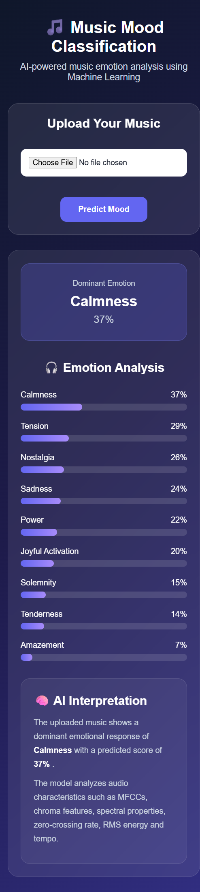

# 🎵 Music Mood Classification Using Machine Learning

An AI-powered web application that analyzes an uploaded music file and predicts its emotional characteristics using Machine Learning and audio signal processing.

The system extracts meaningful audio features such as MFCCs, Chroma, Spectral Centroid, Zero Crossing Rate, RMS Energy and Tempo, and uses them to estimate multiple emotional dimensions of music.

---

## 🎯 Objectives

- Analyze emotional characteristics present in music.
- Extract meaningful features from audio files.
- Apply Machine Learning techniques for emotion prediction.
- Predict multiple emotional dimensions from a single audio file.
- Provide an easy-to-use web interface for music analysis.
- Present prediction results through visual emotion scores.

---

## 🧠 Emotions Analyzed

The system analyzes the following nine emotional dimensions:

- Amazement
- Solemnity
- Tenderness
- Nostalgia
- Calmness
- Power
- Joyful Activation
- Tension
- Sadness

---

## 🎧 Audio Features

The system extracts several audio characteristics using Librosa:

| Feature | Description |
|---|---|
| MFCC | Represents the spectral characteristics of audio |
| Chroma | Represents pitch-class information |
| Spectral Centroid | Indicates the brightness of an audio signal |
| Zero Crossing Rate | Measures signal sign changes |
| RMS Energy | Represents signal energy |
| Tempo | Represents the estimated beats per minute |

These features are converted into numerical values and provided to the Machine Learning model.

---

## 🤖 Machine Learning

The project experiments with multiple Machine Learning approaches:

- Linear Regression
- Random Forest
- XGBoost

The task is treated as a **multi-output regression problem**, where the model predicts continuous scores for the nine emotional dimensions.

### Cross-Validation Results

The models were evaluated using 5-fold cross-validation.

| Model | Average MAE | Average MSE | Average R² |
|---|---:|---:|---:|
| Random Forest | 0.1247 | 0.0245 | 0.1888 |
| XGBoost | 0.1223 | 0.0245 | 0.1769 |

The current web application uses the Random Forest model for emotion prediction.

---

## 🔄 Project Workflow

```text
Audio File
    ↓
Audio Preprocessing
    ↓
Feature Extraction
    ↓
MFCC + Chroma + Spectral Features
    ↓
Machine Learning Model
    ↓
Multi-Output Emotion Prediction
    ↓
Emotion Scores
    ↓
Web Application
```

---

## 🌐 Web Application

The project includes a Flask-based web application that provides an interactive interface for music emotion analysis.

Users can:

1. Upload an MP3 file.
2. Extract audio features automatically.
3. Analyze the music using the trained Machine Learning model.
4. View predicted scores for nine emotional dimensions.
5. Identify the highest predicted emotional dimension.
6. View the results using visual progress bars.
7. Read an AI-generated interpretation of the prediction.

---

## 🖥️ Application Screenshot



---

## 📊 Prediction Output

The model produces a continuous score for each emotional dimension.

The web application sorts these predicted scores and displays them visually.

Example output:

```text
Calmness             37%
Tension              29%
Nostalgia            26%
Sadness              24%
Power                22%
Joyful Activation    20%
Solemnity            15%
Tenderness           14%
Amazement             7%
```

The highest predicted score is displayed as the dominant predicted emotion.

---

## 🧠 AI Interpretation

The application provides a simple interpretation of the prediction.

For example:

```text
The uploaded music shows a dominant emotional response
of Calmness with a predicted score of 37%.

The model analyzes audio characteristics such as MFCCs,
chroma features, spectral properties, zero-crossing rate,
RMS energy and tempo.
```

---

## 🔬 Feature Importance

Feature importance analysis is performed using the Random Forest model to examine the relative contribution of extracted audio features to the predictions.

MFCC and Chroma-based features frequently appear among the important features across different emotional dimensions.

Feature importance indicates the relative contribution of features within the trained model and should not be interpreted as direct causation.

---

## 🛠️ Technologies Used

- Python
- Flask
- Librosa
- NumPy
- Pandas
- Scikit-learn
- XGBoost
- Joblib
- HTML
- CSS
- JavaScript
- Git
- GitHub

---

## 📁 Project Structure

```text
Music_Mood_Classification/
│
├── app.py
├── extract_features.py
├── predict_emotion.py
│
├── train_random_forest.py
├── train_linear_model.py
├── train_xgboost.py
├── cross_validate_models.py
├── feature_importance.py
│
├── prepare_emotion_dataset.py
├── prepare_ml_dataset.py
├── create_final_dataset.py
├── split_data.py
│
├── requirements.txt
├── README.md
├── .gitignore
│
├── templates/
│   └── index.html
│
└── static/
    ├── style.css
    └── music_mood_screenshot.png
```

---

## 🚀 Installation

Clone the repository:

```bash
git clone https://github.com/thesatyam19/Music_Mood_Classification.git
```

Open the project folder:

```bash
cd Music_Mood_Classification
```

Create a virtual environment:

```bash
python -m venv venv
```

Activate the virtual environment on Windows:

```bash
venv\Scripts\activate
```

Install the required libraries:

```bash
pip install -r requirements.txt
```

---

## ▶️ Run the Application

Start the Flask application:

```bash
python app.py
```

Open the application in your browser:

```text
http://127.0.0.1:5000
```

Upload an MP3 file and click:

```text
Predict Mood
```

---

## ⚙️ Feature Extraction

The audio processing pipeline uses Librosa to extract:

```text
Audio
  ↓
MFCC
  ↓
Chroma
  ↓
Spectral Centroid
  ↓
Zero Crossing Rate
  ↓
RMS Energy
  ↓
Tempo
```

Statistical summaries such as mean and standard deviation are calculated from several extracted audio features before they are passed to the Machine Learning model.

---

## 🤖 Model Training

The project includes multiple model training approaches:

### Linear Regression

Used as a baseline Machine Learning approach for multi-output emotion prediction.

### Random Forest

A tree-based ensemble model used for the current web application.

### XGBoost

A gradient boosting approach used for additional model experimentation and comparison.

---

## 📈 Model Evaluation

The models are evaluated using:

- Mean Absolute Error (MAE)
- Mean Squared Error (MSE)
- R² Score

Five-fold cross-validation is used to examine model performance across multiple train-test splits.

---

## 🔮 Future Scope

- Improve prediction performance using larger datasets.
- Experiment with deep learning architectures.
- Add CNN-based audio classification.
- Add spectrogram-based analysis.
- Support additional audio formats.
- Develop a mobile-friendly application.
- Add music recommendation based on predicted emotions.
- Explore real-time music emotion analysis.
- Improve interpretability using advanced Explainable AI techniques.
- Explore transformer-based audio models.

---

## 📌 Dataset and Repository Notes

The raw audio files and generated data/model artifacts are excluded from the Git repository using `.gitignore`.

The repository contains the source code, web application, documentation and configuration files required to understand the project workflow.

---

## 👨‍💻 Project Information

**Project:** Music Mood Classification Using Machine Learning

**Domain:** Artificial Intelligence and Machine Learning

**Application:** Music Emotion Analysis

**Framework:** Flask

**Programming Language:** Python

**Machine Learning Task:** Multi-Output Regression

**Repository:**  
https://github.com/thesatyam19/Music_Mood_Classification

---

## ⭐ Project Highlights

- 🎵 Music emotion analysis
- 🧠 Machine Learning based prediction
- 🎧 Automatic audio feature extraction
- 📊 Nine-dimensional emotion prediction
- 🌐 Flask web application
- 📈 Model evaluation using cross-validation
- 🔬 Feature importance analysis
- 💻 Interactive prediction interface